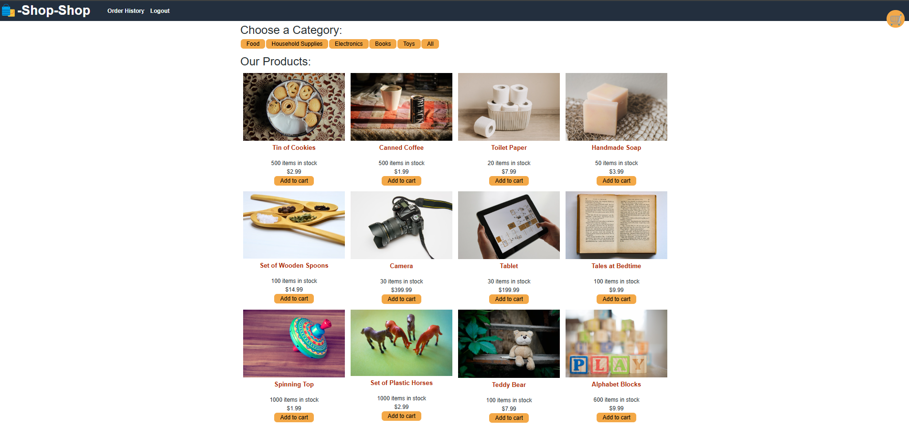
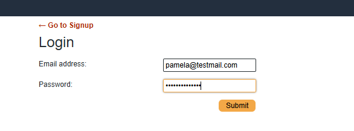
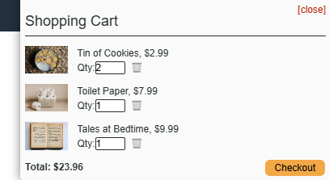
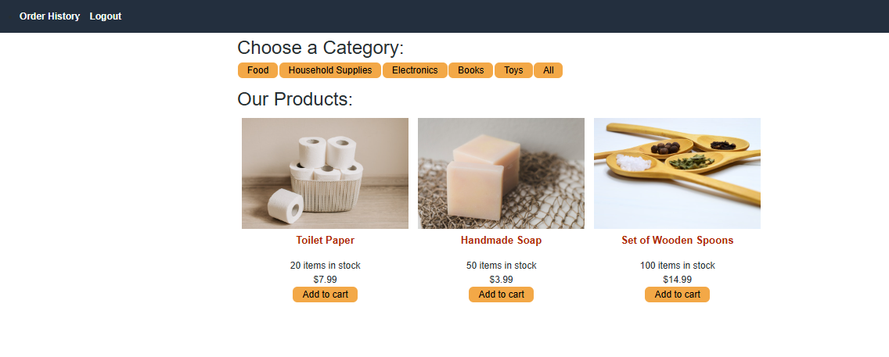
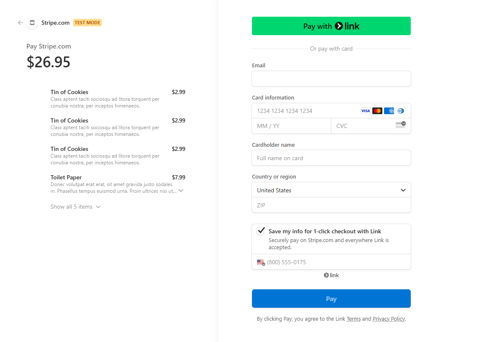

  # Title
   ShopShop
   

  ## Table of Contents

  - [Description](#description)
  - [Design](#design)
  - [Install](#install)
  - [Contributor](#contributor)
  - [License](#license)
  - [Questions](#questions)

  ## Description

   A shopping webpage where a user can select categories and add things into the card. They can then checkout and pay using credit card

  ## Design

    To help shoppers

  ## Install

    npm run develop

  ## Contributor

    mvoidets and class repo

  ## License

    This is not licensed  

  ### Questions

  If you have any questions, please contact me at: [mvoidets@yahoo.com] (mailto:mvoidets@yahoo.com). 

  My GitHub profile is [mvoidets](https://guthub.com/mvoidets).

  Thank you for visiting my repository!